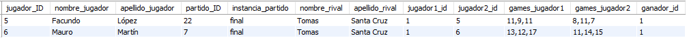

# Trabajo Práctico Final de Base de Datos

## Contexto y Justificación

La base de datos creada ayuda a organizar torneos de tenis de mesa. Elegí este tema porque me interesa el deporte y vi la necesidad de tener un sistema para manejar bien la información de los jugadores, partidos, árbitros y resultados.

Con esta base de datos, es fácil almacenar y consultar todos estos datos, además de ver estadísticas y rankings de los jugadores. Si la conectara a una página web, se podría convertir en una aplicación muy parecida a las que existen hoy en día para la gestión de torneos y seguimiento de jugadores.

## Listado de Entidades, Atributos, Claves y Tipo de Datos Utilizados

1. **club**

   - `ID` **(PK)**: INT
   - `nombre`: VARCHAR(50)
   - `ID_ubicacion` **(FK-Ubicacion)**: INT
   - `fecha_creacion`: DATE

2. **jugador**

   - `ID` **(PK)**: INT
   - `nombre`: VARCHAR(50)
   - `apellido`: VARCHAR(50)
   - `fecha_nac`: DATE
   - `rating`: INT
   - `ID_club` **(FK-Club)**: INT

3. **torneo**

   - `ID` **(PK)**: INT
   - `nombre_torneo`: VARCHAR(50)
   - `fecha`: DATETIME
   - `categoria`: INT
   - `ID_ubicacion` **(FK-Ubicacion)**: INT

4. **arbitro**

   - `ID` **(PK)**: INT
   - `nombre`: VARCHAR(50)
   - `apellido`: VARCHAR(50)
   - `fecha_nac`: DATE

5. **instancia**

   - `ID` **(PK)**: INT
   - `nombre`: VARCHAR(50)

6. **partido**

   - `ID` **(PK)**: INT
   - `ID_arbitro` **(FK-Arbitro)**: INT
   - `ID_jugador1` **(FK-Jugador)**: INT
   - `ID_jugador2` **(FK-Jugador)**: INT
   - `ID_torneo` **(FK-Torneo)**: INT
   - `ID_instancia` **(FK-Instancia)**: INT

7. **sets**

   - `ID` **(PK)**: INT
   - `ID_partido` **(FK-Partido)**: INT
   - `numero_set`: INT
   - `player1_games_won`: INT
   - `player2_games_won`: INT

8. **ubicacion**
   - `ID` **(PK)**: INT
   - `nombre`: VARCHAR(50)

## Modelo Entidad-Relación y Modelo Relacional


## Comandos SQL

### DDL (Data Definition Language)

```sql
-- Creación de la base de datos
CREATE DATABASE table_tennis;
USE table_tennis;

-- Creación de tablas
CREATE TABLE ubicacion (
    ID INT PRIMARY KEY AUTO_INCREMENT NOT NULL,
    nombre VARCHAR(50) NOT NULL
);

CREATE TABLE club (
    ID INT PRIMARY KEY AUTO_INCREMENT NOT NULL,
    nombre VARCHAR(50) NOT NULL,
    ID_ubicacion INT NULL,
    fecha_creacion DATE NOT NULL,
    FOREIGN KEY (ID_ubicacion) REFERENCES ubicacion (ID) ON DELETE SET NULL
);

CREATE TABLE jugador (
    ID INT PRIMARY KEY AUTO_INCREMENT NOT NULL,
    nombre VARCHAR(50) NOT NULL,
    apellido VARCHAR(50) NOT NULL,
    fecha_nac DATE NOT NULL,
    rating INT NOT NULL,
    ID_club INT DEFAULT 1,
    FOREIGN KEY (ID_club) REFERENCES club (ID) ON DELETE SET NULL
);

CREATE TABLE torneo (
    ID INT PRIMARY KEY AUTO_INCREMENT NOT NULL,
    nombre_torneo VARCHAR(50) NOT NULL,
    fecha DATETIME NOT NULL,
    categoria INT NOT NULL,
    ID_ubicacion INT NOT NULL,
    FOREIGN KEY (ID_ubicacion) REFERENCES ubicacion (ID)
);

CREATE TABLE arbitro (
    ID INT PRIMARY KEY AUTO_INCREMENT NOT NULL,
    nombre VARCHAR(50) NOT NULL,
    apellido VARCHAR(50) NOT NULL,
    fecha_nac DATE NOT NULL
);

CREATE TABLE instancia (
    ID INT PRIMARY KEY AUTO_INCREMENT NOT NULL,
    nombre VARCHAR(50) NOT NULL,
    CONSTRAINT instancia_valores_permitidos CHECK (
        nombre IN (
            'final',
            'semifinal',
            'cuartos',
            'octavos',
            'dieciseisavos',
            'treintaidosavos'
        )
    )
);

CREATE TABLE partido (
    ID INT PRIMARY KEY AUTO_INCREMENT NOT NULL,
    ID_arbitro INT NOT NULL,
    ID_jugador1 INT NOT NULL,
    ID_jugador2 INT NOT NULL,
    ID_torneo INT NOT NULL,
    ID_instancia INT NOT NULL,
    FOREIGN KEY (ID_jugador1) REFERENCES jugador (ID) ON DELETE SET NULL,
    FOREIGN KEY (ID_jugador2) REFERENCES jugador (ID) ON DELETE SET NULL,
    FOREIGN KEY (ID_torneo) REFERENCES torneo (ID),
    FOREIGN KEY (ID_arbitro) REFERENCES arbitro (ID) ON DELETE SET NULL,
    FOREIGN KEY (ID_instancia) REFERENCES instancia (ID)
);

CREATE TABLE sets (
    ID INT PRIMARY KEY AUTO_INCREMENT NOT NULL,
    ID_partido INT,
    numero_set INT,
    player1_games_won INT,
    player2_games_won INT,
    FOREIGN KEY (ID_partido) REFERENCES partido (ID)
);
```

### Inserts

```sql
USE table_tennis;

-- Insertar datos en la tabla ubicacion
INSERT INTO
    ubicacion (nombre)
VALUES ('Buenos Aires'),
    ('Av. Directorio 4147'),
    ('Roma 950'),
    ('Moreno 3201, Mar del Plata'),
    ('Ayacucho 3926, Rosario');

-- Insertar datos en la tabla club
INSERT INTO
    club (
        nombre,
        ID_ubicacion,
        fecha_creacion
    )
VALUES (
        'Jugador Libre',
        1,
        '1900-01-01'
    ),
    (
        'Alvear Club',
        2,
        '1935-08-19'
    ),
    (
        'Ateneo Popular de Versailles',
        3,
        '1938-07-02'
    ),
    (
        'Mar del Plata Club',
        4,
        '1950-10-10'
    ),
    (
        'Club Atlético Rosario',
        5,
        '1945-03-12'
    );

-- Insertar datos en la tabla jugador
INSERT INTO
    jugador (
        nombre,
        apellido,
        fecha_nac,
        rating,
        ID_club
    )
VALUES (
        'Tomas',
        'Santa Cruz',
        '2007-05-24',
        0,
        2
    ),
    (
        'Mateo',
        'Diaz',
        '2004-08-05',
        0,
        1
    ),
    (
        'Tiziano',
        'Romeo',
        '1999-02-27',
        0,
        3
    ),
    (
        'Ramiro',
        'González',
        '2000-04-17',
        0,
        1
    ),
    (
        'Facundo',
        'López',
        '1980-12-12',
        0,
        3
    ),
    (
        'Mauro',
        'Martín',
        '1990-07-21',
        0,
        2
    ),
    (
        'Axel',
        'Sánchez',
        '2006-05-17',
        0,
        1
    ),
    (
        'Manuel',
        'Gómez',
        '2010-02-19',
        0,
        2
    ),
    (
        'Lucas',
        'Pérez',
        '1998-09-11',
        0,
        4
    ),
    (
        'Nicolás',
        'Rodríguez',
        '1995-03-30',
        0,
        5
    ),
    (
        'Julian',
        'Molina',
        '2002-07-15',
        0,
        4
    ),
    (
        'Mariano',
        'Silva',
        '1993-12-05',
        0,
        5
    ),
    (
        'Santiago',
        'Martínez',
        '1999-11-05',
        0,
        3
    ),
    (
        'Esteban',
        'Ferrer',
        '2001-01-14',
        0,
        4
    ),
    (
        'Carlos',
        'Álvarez',
        '1985-04-23',
        0,
        5
    ),
    (
        'Raúl',
        'Medina',
        '1992-03-18',
        0,
        2
    );

-- Insertar datos en la tabla arbitro
INSERT INTO
    arbitro (nombre, apellido, fecha_nac)
VALUES (
        'Jose',
        'Rodolfo',
        '1999-12-01'
    ),
    (
        'Agustin',
        'Fernández',
        '2000-06-15'
    ),
    (
        'Jesús',
        'Ramon',
        '2000-06-15'
    ),
    (
        'Carlos',
        'Rivas',
        '1998-08-21'
    );

-- Insertar datos en la tabla instancia
INSERT INTO
    instancia (nombre)
VALUES ('final'),
    ('semifinal'),
    ('cuartos'),
    ('octavos');

-- Insertar datos en la tabla torneo
INSERT INTO
    torneo (
        nombre_torneo,
        fecha,
        categoria,
        ID_ubicacion
    )
VALUES (
        '1er torneo Alvear Club',
        '2024-05-20',
        5,
        2
    ),
    (
        'Copa Mar del Plata',
        '2024-06-15',
        4,
        4
    );

-- Insertar datos en la tabla partido para "1er torneo Alvear Club" empezando desde octavos
INSERT INTO
    partido (
        ID_torneo,
        ID_arbitro,
        ID_jugador1,
        ID_jugador2,
        ID_instancia
    )
VALUES
    -- Octavos de final
    (1, 1, 1, 2, 4),
    (1, 2, 3, 4, 4),
    (1, 3, 5, 6, 4),
    (1, 1, 7, 8, 4),
    (1, 2, 9, 10, 4),
    (1, 3, 11, 12, 4),
    (1, 4, 13, 14, 4),
    (1, 1, 15, 16, 4),
    -- Cuartos de final
    (1, 2, 1, 3, 3),
    (1, 3, 5, 7, 3),
    (1, 4, 9, 11, 3),
    (1, 1, 13, 15, 3),
    -- Semifinal
    (1, 2, 1, 5, 2),
    (1, 3, 9, 13, 2),
    -- Final
    (1, 1, 1, 9, 1);

-- Insertar partidos para el torneo "Copa Mar del Plata" (ID_torneo = 2)
-- Insertar partidos para los torneos "1er Torneo Alvear Club" y "Copa Mar del Plata"
INSERT INTO
    partido (
        ID_torneo,
        ID_arbitro,
        ID_jugador1,
        ID_jugador2,
        ID_instancia
    )
VALUES
    -- Partidos para el torneo "1er Torneo Alvear Club" (ID_torneo = 1)
    (1, 1, 1, 2, 3), -- Cuartos de final
    (1, 2, 3, 4, 3), -- Cuartos de final
    (1, 3, 5, 6, 3), -- Cuartos de final
    (1, 1, 7, 8, 3), -- Cuartos de final
    (1, 2, 1, 3, 2), -- Semifinal
    (1, 3, 6, 8, 2), -- Semifinal
    (1, 1, 1, 6, 1), -- Final
-- Partidos para el torneo "Copa Mar del Plata" (ID_torneo = 2)
-- Octavos de final
(2, 1, 1, 9, 4), -- Partido 1
(2, 2, 2, 10, 4), -- Partido 2
(2, 3, 3, 11, 4), -- Partido 3
(2, 4, 4, 12, 4), -- Partido 4
(2, 1, 5, 13, 4), -- Partido 5
(2, 2, 6, 14, 4), -- Partido 6
(2, 3, 7, 15, 4), -- Partido 7
(2, 4, 8, 16, 4), -- Partido 8
-- Cuartos de final
(2, 1, 1, 2, 3), -- Partido 9
(2, 2, 3, 4, 3), -- Partido 10
(2, 3, 5, 6, 3), -- Partido 11
(2, 4, 7, 8, 3), -- Partido 12
-- Semifinales
(2, 1, 1, 3, 2), -- Partido 13
(2, 2, 5, 7, 2), -- Partido 14
-- Final
(2, 3, 1, 5, 1);
-- Partido 15
-- Insertar sets para cada partido en ambos torneos
INSERT INTO
    sets (
        ID_partido,
        numero_set,
        player1_games_won,
        player2_games_won
    )
VALUES
    -- Sets del torneo "1er Torneo Alvear Club"
    (1, 1, 11, 8),
    (1, 2, 11, 5),
    (2, 1, 11, 7),
    (2, 2, 10, 12),
    (2, 3, 11, 9),
    (3, 1, 3, 11),
    (3, 2, 6, 11),
    (4, 1, 11, 5),
    (4, 2, 5, 11),
    (4, 3, 11, 13),
    (5, 1, 11, 9),
    (5, 2, 13, 11),
    (6, 1, 11, 6),
    (6, 2, 13, 8),
    (7, 1, 13, 11),
    (7, 2, 12, 14),
    (7, 3, 17, 15),
-- Sets del torneo "Copa Mar del Plata" - Octavos
(8, 1, 11, 8),
(8, 2, 9, 11),
(8, 3, 11, 7),
(9, 1, 11, 9),
(9, 2, 8, 11),
(9, 3, 11, 5),
(10, 1, 12, 10),
(10, 2, 11, 9),
(11, 1, 11, 7),
(11, 2, 11, 8),
(12, 1, 9, 11),
(12, 2, 11, 7),
(12, 3, 11, 6),
(13, 1, 11, 5),
(13, 2, 8, 11),
(13, 3, 11, 7),
(14, 1, 10, 12),
(14, 2, 11, 8),
(14, 3, 11, 9),
(15, 1, 11, 4),
(15, 2, 9, 11),
(15, 3, 11, 8),
-- Sets del torneo "Copa Mar del Plata" - Cuartos
(16, 1, 11, 9),
(16, 2, 11, 7),
(17, 1, 11, 5),
(17, 2, 8, 11),
(17, 3, 11, 7),
(18, 1, 10, 12),
(18, 2, 11, 8),
(18, 3, 11, 9),
(19, 1, 11, 7),
(19, 2, 10, 12),
(19, 3, 11, 9),
-- Sets del torneo "Copa Mar del Plata" - Semifinales
(20, 1, 11, 6),
(20, 2, 9, 11),
(20, 3, 11, 8),
(21, 1, 12, 10),
(21, 2, 11, 7),
-- Sets del torneo "Copa Mar del Plata" - Final
(22, 1, 11, 8), (22, 2, 9, 11), (22, 3, 11, 7);
```

### Updates

```sql
-- Actualizar el nombre de un club
UPDATE club SET nombre = 'Club Deportivo Alvear' WHERE ID = 2;

-- Actualizar el rating de un jugador
UPDATE jugador SET rating = 1500 WHERE ID = 1;

-- Actualizar la fecha de un torneo
UPDATE torneo SET fecha = '2024-07-01' WHERE ID = 1;
```

### Deletes

```sql
-- Eliminar un jugador
DELETE FROM jugador WHERE ID = 8;

-- Eliminar un partido
DELETE FROM partido WHERE ID = 7;

-- Eliminar un set
DELETE FROM sets WHERE ID = 15;
```

## Subconsultas

### 1. Estadísticas de Jugadores

```sql
SELECT
    j.ID AS jugador_ID,
    j.nombre AS nombre_jugador,
    j.apellido AS apellido_jugador,
    j.rating AS rating_jugador,
    SUM(
        CASE
            WHEN p.ID_jugador1 = j.ID
            OR p.ID_jugador2 = j.ID THEN 1
            ELSE 0
        END
    ) AS partidos_jugados,
    SUM(
        CASE
            WHEN i.nombre = 'final'
            AND (
                p.ID_jugador1 = j.ID
                OR p.ID_jugador2 = j.ID
            ) THEN 1
            ELSE 0
        END
    ) AS finales_jugadas,
    SUM(
        CASE
            WHEN i.nombre = 'final'
            AND (
                p.ID_jugador1 = j.ID
                OR p.ID_jugador2 = j.ID
            )
            AND obtenerGanadorPartido (p.ID) = j.ID THEN 1
            ELSE 0
        END
    ) AS finales_ganadas,
    SUM(
        CASE
            WHEN obtenerGanadorPartido (p.ID) = j.ID THEN 1
            ELSE 0
        END
    ) AS partidos_ganados
FROM
    jugador j
    LEFT JOIN partido p ON j.ID = p.ID_jugador1
    OR j.ID = p.ID_jugador2
    LEFT JOIN instancia i ON p.ID_instancia = i.ID
GROUP BY
    j.ID;
```


### 2. Puntaje Máximo por Club

```sql
SELECT
    c.ID AS club_ID,
    c.nombre AS nombre_club,
    SUM(j.rating) AS puntaje_maximo,
    COUNT(*) AS cantidad_jugadores
FROM club c
    INNER JOIN jugador j ON c.ID = j.ID_club
GROUP BY
    c.ID
ORDER BY puntaje_maximo;
```


### 3. Ranking de Jugadores por Club

```sql
SELECT
    c.ID AS club_ID,
    c.nombre AS nombre_club,
    j.ID AS jugador_ID,
    j.nombre AS nombre_jugador,
    j.apellido AS apellido_jugador,
    j.rating AS rating_jugador
FROM club c
    INNER JOIN jugador j ON c.ID = j.ID_club
ORDER BY c.ID, j.rating DESC;
```


### 4. Partidos por Torneo

```sql
SELECT
    t.ID AS torneo_ID,
    t.nombre_torneo AS nombre_torneo,
    p.ID AS partido_ID,
    i.nombre AS instancia_partido,
    j1.nombre AS nombre_jugador1,
    j1.apellido AS apellido_jugador1,
    j2.nombre AS nombre_jugador2,
    j2.apellido AS apellido_jugador2,
    GROUP_CONCAT(
        s.player1_games_won
        ORDER BY s.numero_set
    ) AS games_jugador1,
    GROUP_CONCAT(
        s.player2_games_won
        ORDER BY s.numero_set
    ) AS games_jugador2,
    obtenerGanadorPartido (p.ID) AS ganador_id
FROM
    torneo t
    INNER JOIN partido p ON t.ID = p.ID_torneo
    INNER JOIN jugador j1 ON p.ID_jugador1 = j1.ID
    INNER JOIN jugador j2 ON p.ID_jugador2 = j2.ID
    INNER JOIN sets s ON p.ID = s.ID_partido
    INNER JOIN instancia i ON p.ID_instancia = i.ID
GROUP BY
    t.ID,
    t.nombre_torneo,
    p.ID,
    i.nombre,
    j1.nombre,
    j1.apellido,
    j2.nombre,
    j2.apellido
ORDER BY t.ID, i.nombre, j1.rating DESC, j2.rating DESC;
```


### 5. Partidos por Jugador

```sql
SELECT
    j.ID AS jugador_ID,
    j.nombre AS nombre_jugador,
    j.apellido AS apellido_jugador,
    p.ID AS partido_ID,
    i.nombre AS instancia_partido,
    CASE
        WHEN j.nombre = j1.nombre THEN j2.nombre
        WHEN j.nombre = j2.nombre THEN j1.nombre
    END AS nombre_rival,
    CASE
        WHEN j.nombre = j1.nombre THEN j2.apellido
        WHEN j.nombre = j2.nombre THEN j1.apellido
    END AS apellido_rival,
    j1.id AS jugador1_id,
    j2.id AS jugador2_id,
    GROUP_CONCAT(
        s.player1_games_won
        ORDER BY s.numero_set
    ) AS games_jugador1,
    GROUP_CONCAT(
        s.player2_games_won
        ORDER BY s.numero_set
    ) AS games_jugador2,
    obtenerGanadorPartido (p.ID) AS ganador_id
FROM
    jugador j
    INNER JOIN partido p ON j.ID = p.ID_jugador1
    OR j.ID = p.ID_jugador2
    INNER JOIN sets s ON p.ID = s.ID_partido
    INNER JOIN jugador j1 ON p.ID_jugador1 = j1.ID
    INNER JOIN jugador j2 ON p.ID_jugador2 = j2.ID
    INNER JOIN instancia i ON p.ID_instancia = i.ID
GROUP BY
    j.ID,
    j.nombre,
    j.apellido,
    p.ID,
    i.nombre,
    j1.nombre,
    j1.apellido,
    j2.nombre,
    j2.apellido
ORDER BY j.ID, i.nombre, j1.rating DESC, j2.rating DESC;
```


### 6. Finales por Jugador

```sql
SELECT
    j.ID AS jugador_ID,
    j.nombre AS nombre_jugador,
    j.apellido AS apellido_jugador,
    p.ID AS partido_ID,
    i.nombre AS instancia_partido,
    CASE
        WHEN j.nombre = j1.nombre THEN j2.nombre
        WHEN j.nombre = j2.nombre THEN j1.nombre
    END AS nombre_rival,
    CASE
        WHEN j.nombre = j1.nombre THEN j2.apellido
        WHEN j.nombre = j2.nombre THEN j1.apellido
    END AS apellido_rival,
    j1.id AS jugador1_id,
    j2.id AS jugador2_id,
    GROUP_CONCAT(
        s.player1_games_won
        ORDER BY s.numero_set
    ) AS games_jugador1,
    GROUP_CONCAT(
        s.player2_games_won
        ORDER BY s.numero_set
    ) AS games_jugador2,
    obtenerGanadorPartido (p.ID) AS ganador_id
FROM
    jugador j
    INNER JOIN partido p ON j.ID = p.ID_jugador1
    OR j.ID = p.ID_jugador2
    INNER JOIN sets s ON p.ID = s.ID_partido
    INNER JOIN jugador j1 ON p.ID_jugador1 = j1.ID
    INNER JOIN jugador j2 ON p.ID_jugador2 = j2.ID
    INNER JOIN instancia i ON p.ID_instancia = i.ID
WHERE
    i.nombre = 'final'
GROUP BY
    j.ID,
    j.nombre,
    j.apellido,
    p.ID,
    i.nombre,
    j1.nombre,
    j1.apellido,
    j2.nombre,
    j2.apellido
ORDER BY j.ID, i.nombre, j1.rating DESC, j2.rating DESC;
```


### 7. Finales Ganadas por Jugador

```sql
SELECT
    j.ID AS jugador_ID,
    j.nombre AS nombre_jugador,
    j.apellido AS apellido_jugador,
    p.ID AS partido_ID,
    i.nombre AS instancia_partido,
    CASE
        WHEN j.nombre = j1.nombre THEN j2.nombre
        WHEN j.nombre = j2.nombre THEN j1.nombre
    END AS nombre_rival,
    CASE
        WHEN j.nombre = j1.nombre THEN j2.apellido
        WHEN j.nombre = j2.nombre THEN j1.apellido
    END AS apellido_rival,
    j1.id AS jugador1_id,
    j2.id AS jugador2_id,
    GROUP_CONCAT(
        s.player1_games_won
        ORDER BY s.numero_set
    ) AS games_jugador1,
    GROUP_CONCAT(
        s.player2_games_won
        ORDER BY s.numero_set
    ) AS games_jugador2,
    obtenerGanadorPartido (p.ID) AS ganador_id
FROM
    jugador j
    INNER JOIN partido p ON j.ID = p.ID_jugador1
    OR j.ID = p.ID_jugador2
    INNER JOIN sets s ON p.ID = s.ID_partido
    INNER JOIN jugador j1 ON p.ID_jugador1 = j1.ID
    INNER JOIN jugador j2 ON p.ID_jugador2 = j2.ID
    INNER JOIN instancia i ON p.ID_instancia = i.ID
WHERE
    i.nombre = 'final'
    AND obtenerGanadorPartido (p.ID) = j.ID
GROUP BY
    j.ID,
    j.nombre,
    j.apellido,
    p.ID,
    i.nombre,
    j1.nombre,
    j1.apellido,
    j2.nombre,
    j2.apellido
ORDER BY j.ID, i.nombre, j1.rating DESC, j2.rating DESC;
```


### 8. Finales Perdidas por Jugador

```sql
SELECT
    j.ID AS jugador_ID,
    j.nombre AS nombre_jugador,
    j.apellido AS apellido_jugador,
    p.ID AS partido_ID,
    i.nombre AS instancia_partido,
    CASE
        WHEN j.nombre = j1.nombre THEN j2.nombre
        WHEN j.nombre = j2.nombre THEN j1.nombre
    END AS nombre_rival,
    CASE
        WHEN j.nombre = j1.nombre THEN j2.apellido
        WHEN j.nombre = j2.nombre THEN j1.apellido
    END AS apellido_rival,
    j1.id AS jugador1_id,
    j2.id AS jugador2_id,
    GROUP_CONCAT(
        s.player1_games_won
        ORDER BY s.numero_set
    ) AS games_jugador1,
    GROUP_CONCAT(
        s.player2_games_won
        ORDER BY s.numero_set
    ) AS games_jugador2,
    obtenerGanadorPartido (p.ID) AS ganador_id
FROM
    jugador j
    INNER JOIN partido p ON j.ID = p.ID_jugador1
    OR j.ID = p.ID_jugador2
    INNER JOIN sets s ON p.ID = s.ID_partido
    INNER JOIN jugador j1 ON p.ID_jugador1 = j1.ID
    INNER JOIN jugador j2 ON p.ID_jugador2 = j2.ID
    INNER JOIN instancia i ON p.ID_instancia = i.ID
WHERE
    i.nombre = 'final'
    AND obtenerGanadorPartido (p.ID) != j.ID
GROUP BY
    j.ID,
    j.nombre,
    j.apellido,
    p.ID,
    i.nombre,
    j1.nombre,
    j1.apellido,
    j2.nombre,
    j2.apellido
ORDER BY j.ID, i.nombre, j1.rating DESC, j2.rating DESC;
```



### 9. Partidos Ganados por Jugador

```sql
SELECT
    j.ID AS jugador_ID,
    j.nombre AS nombre_jugador,
    j.apellido AS apellido_jugador,
    p.ID AS partido_ID,
    i.nombre AS instancia_partido,
    CASE
        WHEN j.nombre = j1.nombre THEN j2.nombre
        WHEN j.nombre = j2.nombre THEN j1.nombre
    END AS nombre_rival,
    CASE
        WHEN j.nombre = j1.nombre THEN j2.apellido
        WHEN j.nombre = j2.nombre THEN j1.apellido
    END AS apellido_rival,
    j1.id AS jugador1_id,
    j2.id AS jugador2_id,
    GROUP_CONCAT(
        s.player1_games_won
        ORDER BY s.numero_set
    ) AS games_jugador1,
    GROUP_CONCAT(
        s.player2_games_won
        ORDER BY s.numero_set
    ) AS games_jugador2,
    obtenerGanadorPartido (p.ID) AS ganador_id
FROM
    jugador j
    INNER JOIN partido p ON j.ID = p.ID_jugador1
    OR j.ID = p.ID_jugador2
    INNER JOIN sets s ON p.ID = s.ID_partido
    INNER JOIN jugador j1 ON p.ID_jugador1 = j1.ID
    INNER JOIN jugador j2 ON p.ID_jugador2 = j2.ID
    INNER JOIN instancia i ON p.ID_instancia = i.ID
WHERE
    j.ID = obtenerGanadorPartido (p.ID)
GROUP BY
    j.ID,
    j.nombre,
    j.apellido,
    p.ID,
    i.nombre,
    j1.nombre,
    j1.apellido,
    j2.nombre,
    j2.apellido
ORDER BY j.ID, i.nombre, j1.rating DESC, j2.rating DESC;
```


### 10. Partidos Perdidos por Jugador

```sql
SELECT
    j.ID AS jugador_ID,
    j.nombre AS nombre_jugador,
    j.apellido AS apellido_jugador,
    p.ID AS partido_ID,
    i.nombre AS instancia_partido,
    CASE
        WHEN j.nombre = j1.nombre THEN j2.nombre
        WHEN j.nombre = j2.nombre THEN j1.nombre
    END AS nombre_rival,
    CASE
        WHEN j.nombre = j1.nombre THEN j2.apellido
        WHEN j.nombre = j2.nombre THEN j1.apellido
    END AS apellido_rival,
    j1.id AS jugador1_id,
    j2.id AS jugador2_id,
    GROUP_CONCAT(
        s.player1_games_won
        ORDER BY s.numero_set
    ) AS games_jugador1,
    GROUP_CONCAT(
        s.player2_games_won
        ORDER BY s.numero_set
    ) AS games_jugador2,
    obtenerGanadorPartido (p.ID) AS ganador_id
FROM
    jugador j
    INNER JOIN partido p ON j.ID = p.ID_jugador1
    OR j.ID = p.ID_jugador2
    INNER JOIN sets s ON p.ID = s.ID_partido
    INNER JOIN jugador j1 ON p.ID_jugador1 = j1.ID
    INNER JOIN jugador j2 ON p.ID_jugador2 = j2.ID
    INNER JOIN instancia i ON p.ID_instancia = i.ID
WHERE
    j.ID != obtenerGanadorPartido (p.ID)
GROUP BY
    j.ID,
    j.nombre,
    j.apellido,
    p.ID,
    i.nombre,
    j1.nombre,
    j1.apellido,
    j2.nombre,
    j2.apellido
ORDER BY j.ID, i.nombre, j1.rating DESC, j2.rating DESC;
```


### 11. Promedio de Rating por Club

```sql
SELECT
    c.ID AS club_ID,
    c.nombre AS nombre_club,
    AVG(j.rating) AS promedio_rating,
    COUNT(j.ID) AS cantidad_jugadores
FROM club c
    INNER JOIN jugador j ON c.ID = j.ID_club
GROUP BY
    c.ID,
    c.nombre
HAVING
    COUNT(j.ID) > 1
ORDER BY promedio_rating DESC;
```


### 12. Promedio de Sets Ganados por Jugador

```sql
SELECT
    j.ID AS jugador_ID,
    j.nombre AS nombre_jugador,
    j.apellido AS apellido_jugador,
    AVG(
        CASE
            WHEN s.player1_games_won > s.player2_games_won
            AND p.ID_jugador1 = j.ID THEN 1
            WHEN s.player2_games_won > s.player1_games_won
            AND p.ID_jugador2 = j.ID THEN 1
            ELSE 0
        END
    ) AS promedio_sets_ganados
FROM
    jugador j
    INNER JOIN partido p ON j.ID = p.ID_jugador1
    OR j.ID = p.ID_jugador2
    INNER JOIN sets s ON p.ID = s.ID_partido
GROUP BY
    j.ID,
    j.nombre,
    j.apellido
ORDER BY promedio_sets_ganados DESC;
```


### 13. Promedio de Edad de Jugadores por Club

```sql
SELECT
    c.ID AS club_ID,
    c.nombre AS nombre_club,
    AVG(
        YEAR(CURDATE()) - YEAR(j.fecha_nac)
    ) AS promedio_edad
FROM club c
    INNER JOIN jugador j ON c.ID = j.ID_club
GROUP BY
    c.ID,
    c.nombre
ORDER BY promedio_edad DESC;
```


### 14. Winrate de Jugadores

```sql
SELECT
    j.ID AS jugador_ID,
    j.nombre AS nombre_jugador,
    j.apellido AS apellido_jugador,
    SUM(
        CASE
            WHEN j.ID = obtenerGanadorPartido (p.ID) THEN 1
            ELSE 0
        END
    ) AS partidos_ganados,
    COUNT(*) AS partidos_jugados,
    SUM(
        CASE
            WHEN j.ID = obtenerGanadorPartido (p.ID) THEN 1
            ELSE 0
        END
    ) / COUNT(*) AS winrate
FROM jugador j
    INNER JOIN partido p ON j.ID = p.ID_jugador1
    OR j.ID = p.ID_jugador2
GROUP BY
    j.ID,
    j.nombre,
    j.apellido
ORDER BY winrate DESC;
```


## Modificación de Restricciones de FK

1. En la tabla `partido`, cambiar la restricción de `ID_jugador1` a `ON DELETE CASCADE` para eliminar todos los partidos asociados cuando se elimina un jugador.
2. En la tabla `partido`, cambiar la restricción de `ID_jugador2` a `ON DELETE CASCADE` para eliminar todos los partidos asociados cuando se elimina un jugador.
3. En la tabla `partido`, cambiar la restricción de `ID_arbitro` a `ON DELETE SET NULL` para mantener el registro del partido pero sin árbitro cuando se elimina un árbitro.
4. En la tabla `club`, cambiar la restricción de `ID_ubicacion` a `ON DELETE SET NULL` para mantener el registro del club pero sin ubicación cuando se elimina una ubicación.
