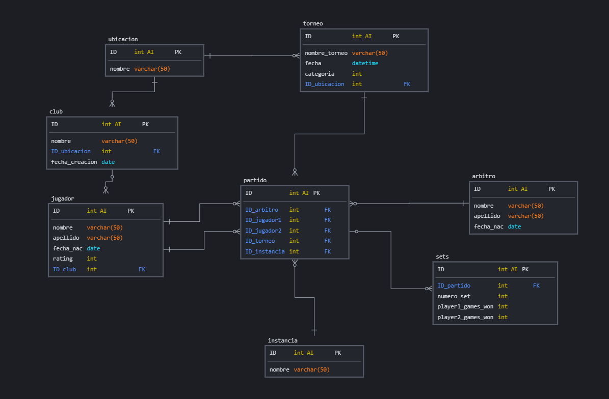

# Base de Datos de Tenis de Mesa

Esta es una base de datos diseñada para gestionar torneos de tenis de mesa, jugadores, partidos, árbitros, clubes y sets. 

## Modelo relacional

## Tablas

1. **club**

   - `ID` **(PK)**
   - `nombre`
   - `ubicacion`
   - `fecha_creacion`

2. **jugador**

   - `ID` **(PK)**
   - `nombre`
   - `apellido`
   - `fecha_nac`
   - `rating`
   - `ID_club` **(FK-Club)**

3. **torneo**

   - `ID` **(PK)**
   - `nombre_torneo`
   - `fecha`
   - `categoria`
   - `localidad`

4. **arbitro**

   - `ID` **(PK)**
   - `nombre`
   - `apellido`
   - `fecha_nac`

5. **partido**

   - `ID` **(PK)**
   - `ID_arbitro` **(FK-Arbitro)**
   - `ID_jugador1` **(FK-Jugador)**
   - `ID_jugador2` **(FK-Jugador)**
   - `ID_torneo` **(FK-Torneo)**
   - `instancia` (etapa del torneo en la que se juega el partido)

6. **sets**
   - `ID` **(PK)**
   - `ID_partido` **(FK-Partido)**
   - `numero_set`
   - `player1_games_won`
   - `player2_games_won`

## Funciones

- **obtenerGanadorPartido(ID_partido INT)**

- **actualizarRanking(ID_partido INT)**
